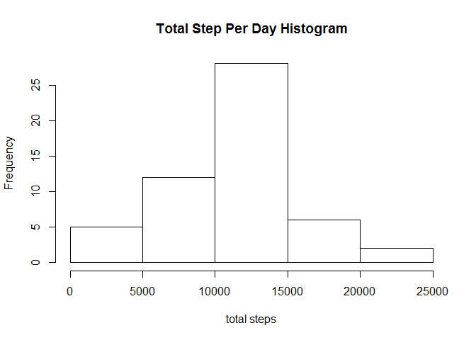
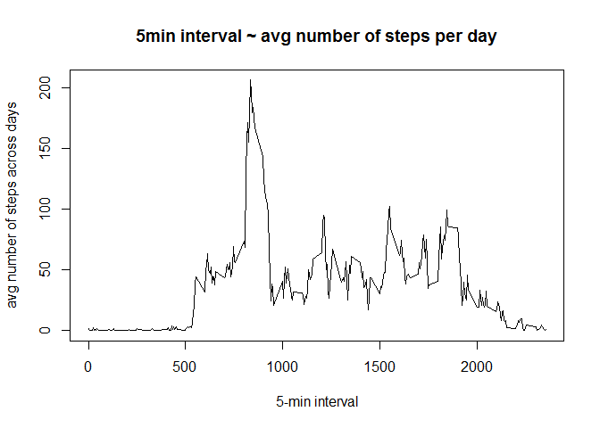
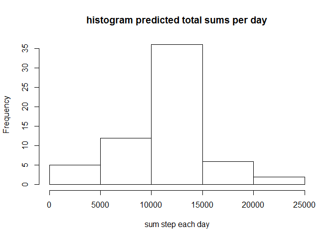
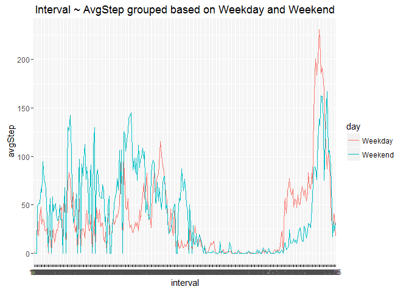

``` r
library(ggplot2)
activity <- read.csv("activity.csv")
```

\[A\] What is mean total number of steps taken per day?
-------------------------------------------------------

#### 1. Calculate the total number of steps taken per day

``` r
avgStepPerDay <- data.frame(averageSteps = with(activity, tapply(steps, date, mean) ))
avgStepPerDay
```

    ##            averageSteps
    ## 2012-10-01           NA
    ## 2012-10-02    0.4375000
    ## 2012-10-03   39.4166667
    ## 2012-10-04   42.0694444
    ## 2012-10-05   46.1597222
    ## 2012-10-06   53.5416667
    ## 2012-10-07   38.2465278
    ## 2012-10-08           NA
    ## 2012-10-09   44.4826389
    ## 2012-10-10   34.3750000
    ## 2012-10-11   35.7777778
    ## 2012-10-12   60.3541667
    ## 2012-10-13   43.1458333
    ## 2012-10-14   52.4236111
    ## 2012-10-15   35.2048611
    ## 2012-10-16   52.3750000
    ## 2012-10-17   46.7083333
    ## 2012-10-18   34.9166667
    ## 2012-10-19   41.0729167
    ## 2012-10-20   36.0937500
    ## 2012-10-21   30.6284722
    ## 2012-10-22   46.7361111
    ## 2012-10-23   30.9652778
    ## 2012-10-24   29.0104167
    ## 2012-10-25    8.6527778
    ## 2012-10-26   23.5347222
    ## 2012-10-27   35.1354167
    ## 2012-10-28   39.7847222
    ## 2012-10-29   17.4236111
    ## 2012-10-30   34.0937500
    ## 2012-10-31   53.5208333
    ## 2012-11-01           NA
    ## 2012-11-02   36.8055556
    ## 2012-11-03   36.7048611
    ## 2012-11-04           NA
    ## 2012-11-05   36.2465278
    ## 2012-11-06   28.9375000
    ## 2012-11-07   44.7326389
    ## 2012-11-08   11.1770833
    ## 2012-11-09           NA
    ## 2012-11-10           NA
    ## 2012-11-11   43.7777778
    ## 2012-11-12   37.3784722
    ## 2012-11-13   25.4722222
    ## 2012-11-14           NA
    ## 2012-11-15    0.1423611
    ## 2012-11-16   18.8923611
    ## 2012-11-17   49.7881944
    ## 2012-11-18   52.4652778
    ## 2012-11-19   30.6979167
    ## 2012-11-20   15.5277778
    ## 2012-11-21   44.3993056
    ## 2012-11-22   70.9270833
    ## 2012-11-23   73.5902778
    ## 2012-11-24   50.2708333
    ## 2012-11-25   41.0902778
    ## 2012-11-26   38.7569444
    ## 2012-11-27   47.3819444
    ## 2012-11-28   35.3576389
    ## 2012-11-29   24.4687500
    ## 2012-11-30           NA

#### 2. If you do not understand the difference between a histogram and a barplot, research the difference between them. Make a histogram of the total number of steps taken each day

``` r
totStepPerDay <- data.frame(totalSteps = with(activity, tapply(steps, date, sum) ))
hist(totStepPerDay[,"totalSteps"], xlab = "total steps", main = "Total Step Per Day Histogram")
```



#### 3. Calculate and report the mean and median of the total number of steps taken per day

``` r
#mean
mean(totStepPerDay[,1], na.rm = TRUE)
```

    ## [1] 10766.19

``` r
#median
median(totStepPerDay[,1], na.rm = TRUE)
```

    ## [1] 10765

\[B\] What is the average daily activity pattern?
-------------------------------------------------

#### 1. Make a time series plot (i.e. type = "l") of the 5-minute interval (x-axis) and the average number of steps taken, averaged across all days (y-axis)

``` r
activity.narm <- activity[-which(is.na(activity$steps)), ]
avgPerInterval <- data.frame(avgPerInterval = with(activity.narm, tapply(steps, interval, mean) ))

plot(as.numeric(row.names(avgPerInterval)), avgPerInterval$avgPerInterval, type = 'l', xlab = "5-min interval", ylab = "avg number of steps across days", main = "5min interval ~ avg number of steps per day")
```



#### 2. Which 5-minute interval, on average across all the days in the dataset, contains the maximum number of steps?

``` r
indexMax <- which(avgPerInterval[,1] %in% max(avgPerInterval[,1]) )
row.names(avgPerInterval)[indexMax]
```

    ## [1] "835"

\[C\] Imputing missing values
-----------------------------

#### 1. Calculate and report the total number of missing values in the dataset (i.e. the total number of rows with NAs)

``` r
length(is.na(activity$steps))
```

    ## [1] 17568

#### 2. Devise a strategy for filling in all of the missing values in the dataset. The strategy does not need to be sophisticated. For example, you could use the mean/median for that day, or the mean for that 5-minute interval, etc.

The strategy will be to fill in the missing values with the mean for that 5-minute interval.

#### 3. Create a new dataset that is equal to the original dataset but with the missing data filled in.

``` r
activityPredict <- activity

vectorNA <- which(is.na(activity$steps))

for(i in vectorNA){
  referenceInterval <- activityPredict[i, "interval"]
  activityPredict[i, "steps"] <- avgPerInterval[which(as.numeric(row.names(avgPerInterval)) %in% referenceInterval), "avgPerInterval"][[1]]
}
```

#### 4. Make a histogram of the total number of steps taken each day and Calculate and report the mean and median total number of steps taken per day. Do these values differ from the estimates from the first part of the assignment? What is the impact of imputing missing data on the estimates of the total daily number of steps?

``` r
activityPredictSum <- with(activityPredict, tapply(steps, date, sum) )
hist(activityPredictSum, xlab = "sum step each day", main = "histogram predicted total sums per day")
```



``` r
#mean
mean(activityPredictSum)
```

    ## [1] 10766.19

``` r
#median
median(activityPredictSum)
```

    ## [1] 10766.19

#### The predicted mean and median of the total number of steps taken each day is similar to the values when we exclude NA values. Imputing the missing data has little effect on the data

\[D\] Are there differences in activity patterns between weekdays and weekends?
-------------------------------------------------------------------------------

#### 1. Create a new factor variable in the dataset with two levels - "weekday" and "weekend" indicating whether a given date is a weekday or weekend day.

``` r
activityPredict["day"] <- weekdays(as.Date(activityPredict$date))
activityPredict$day[which(activityPredict$day %in% c("Saturday","Sunday") )] <- "Weekend"
activityPredict$day[which(!activityPredict$day %in% c("Weekend")) ] <- "Weekday"
```

#### 2. Make a panel plot containing a time series plot (i.e. type = "l") of the 5-minute interval (x-axis) and the average number of steps taken, averaged across all weekday days or weekend days (y-axis). See the README file in the GitHub repository to see an example of what this plot should look like using simulated data.

``` r
plotTable <- data.frame(tapply(activityPredict$steps, paste(activityPredict$interval, activityPredict$day, sep="_"), mean) )

plotTable <- cbind(do.call(rbind, strsplit(row.names(plotTable), "_")), plotTable)
names(plotTable) <- c("interval", "day", "avgStep")

ggplot(plotTable, aes(interval, avgStep)) + geom_line(aes(color = day, group = day)) + ggtitle("Interval ~ AvgStep grouped based on Weekday and Weekend")
```



### By eye, there seems to be a higher average step earlier in the day during the weekends. However, near the latter intervals, there are higher steps in the weekday than the weekend.
